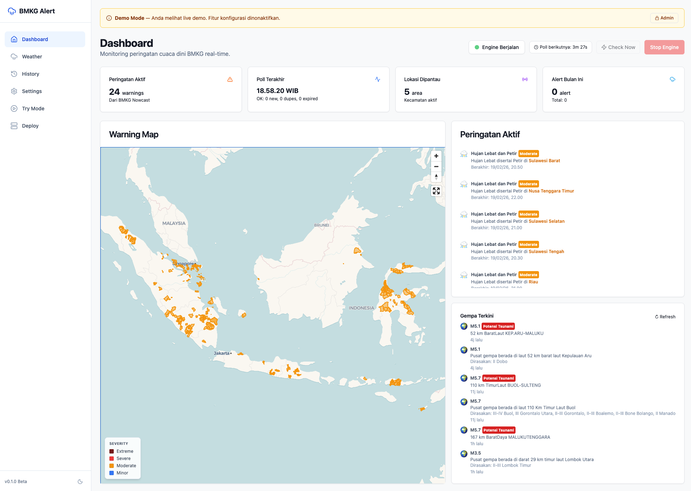
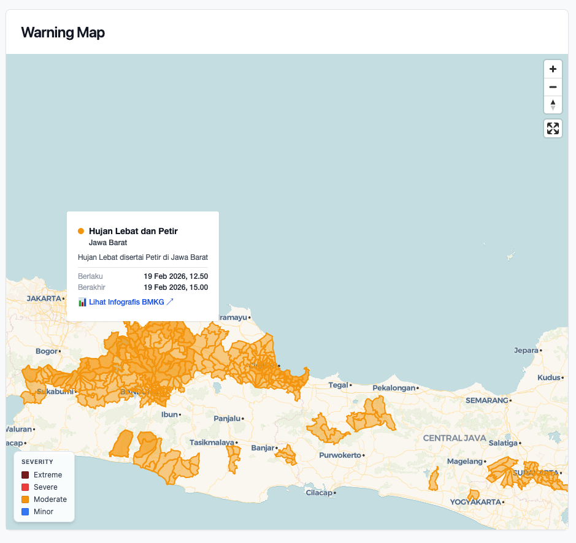
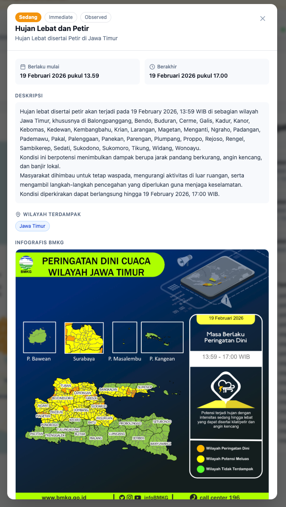
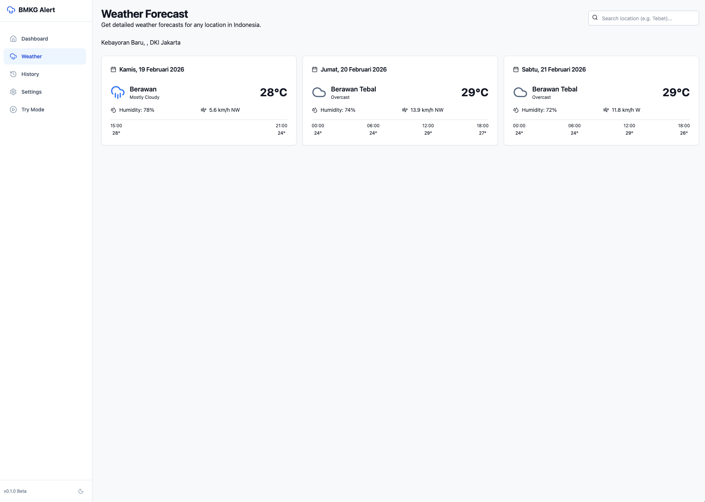
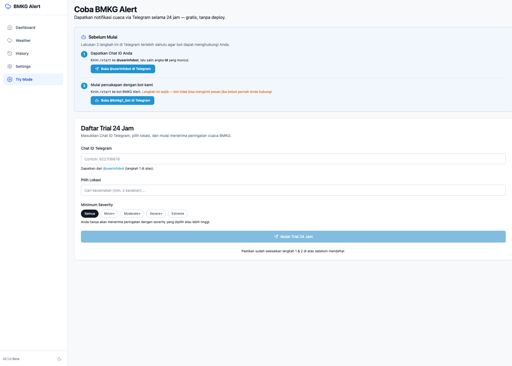

# BMKG Alert

Real-time Indonesian weather warning system powered by BMKG Nowcast data.
Monitor specific locations (kecamatan level) and receive instant notifications via Telegram, Discord, Slack, Email, or Webhook when severe weather approaches.

**[Live Demo →](https://bmkg-alert.dhanypedia.it.com/)** · Try the 24-hour Telegram trial from the demo site.

---

## Screenshots



<table>
  <tr>
    <td></td>
    <td></td>
  </tr>
  <tr>
    <td></td>
    <td></td>
  </tr>
</table>

---

## Features

- **Real-time monitoring** — polls BMKG Nowcast every configurable interval
- **Precise location matching** — kecamatan (subdistrict) level monitoring
- **Multi-channel notifications** — Telegram, Discord, Slack, Email, Webhook
- **Warning Map** — visualize BMKG polygon areas on an interactive map
- **Alert History** — full log with severity filtering and delivery tracking
- **Setup Wizard** — guided 5-step first-time configuration
- **Try Mode** — 24-hour Telegram trial for visitors (no deployment needed)
- **Demo Mode** — run a public read-only demo with admin bypass
- **Quiet Hours** — suppress notifications during configured hours
- **Export / Import** — back up and restore full configuration as JSON
- **Self-hosted** — runs entirely on your own server, no cloud required

---

## Quick Start

### Prerequisites

- Docker and Docker Compose

### Run with Docker

```bash
git clone https://github.com/dhanyyudi/bmkg-alert.git
cd bmkg-alert

# Copy and fill in your configuration
cp .env.example .env
```

Edit `.env` at minimum:

```env
ADMIN_PASSWORD=your-strong-password
TELEGRAM_BOT_TOKEN=1234567890:AAxxxxxxxx   # from @BotFather
```

```bash
docker compose up -d
```

Open **http://localhost:3000** — the Setup Wizard will guide you through the rest.

---

## Setting Up Telegram

1. Open Telegram, search for **@BotFather**
2. Send `/newbot` and follow the prompts
3. Copy the **Bot Token** → set as `TELEGRAM_BOT_TOKEN` in `.env`
4. Get your **Chat ID**: send `/start` to **@userinfobot**, copy the number
5. Set it as `TELEGRAM_CHAT_ID` in `.env` (for the default system channel)

---

## Configuration

All settings are in `.env` (copy from `.env.example`):

| Variable | Required | Description |
|----------|----------|-------------|
| `ADMIN_PASSWORD` | Yes | Admin login password (change from default!) |
| `TELEGRAM_BOT_TOKEN` | For Telegram | Bot token from @BotFather |
| `TELEGRAM_CHAT_ID` | For Telegram | Your chat/group ID |
| `DEMO_MODE` | No | `true` = read-only public demo |
| `DB_PATH` | No | SQLite database path (default: `data/bmkg_alert.db`) |
| `BMKG_API_URL` | No | BMKG API base URL |
| `LOG_LEVEL` | No | `DEBUG`, `INFO`, `WARNING` (default: `INFO`) |
| `TZ` | No | Timezone (default: `Asia/Jakarta`) |

Optional notification channels:

| Variable | Description |
|----------|-------------|
| `DISCORD_WEBHOOK_URL` | Discord incoming webhook URL |
| `SLACK_WEBHOOK_URL` | Slack incoming webhook URL |
| `SMTP_HOST` / `SMTP_USER` / `SMTP_PASSWORD` | Email via SMTP |
| `GENERIC_WEBHOOK_URL` | Generic JSON webhook |

---

## Production Deployment

The included `docker-compose.yml` exposes port `3000` on the frontend container. The frontend internally proxies all `/api` requests to the backend — you only need to expose one service.

### Behind a Reverse Proxy (Nginx, Caddy, Cloudflare Tunnel, etc.)

If you prefer not to expose a host port, remove the `ports` block from `docker-compose.yml` and point your proxy directly to `bmkg-alert-frontend:3000` on your Docker network.

Example Caddy config:

```
bmkg-alert.example.com {
    reverse_proxy bmkg-alert-frontend:3000
}
```

Example Nginx location block:

```nginx
server {
    server_name bmkg-alert.example.com;
    location / {
        proxy_pass http://localhost:3000;
        proxy_set_header Host $host;
        proxy_set_header X-Real-IP $remote_addr;
    }
}
```

### Data Persistence

All data is stored in `./data/backend/` on the host. Back up this directory to preserve your configuration, alert history, and database.

### Keeping It Updated

```bash
docker compose pull
docker compose up -d
```

### Volume Permissions

If the backend container fails to write to `./data/`, ensure the directory is owned by UID 1000:

```bash
sudo chown -R 1000:1000 ./data/
```

---

## Development

```bash
# Run with hot-reload (backend) and rebuild (frontend)
docker compose -f docker-compose.dev.yml up

# Or run individually:
# Backend
cd backend && pip install -r requirements.txt
uvicorn app.main:app --reload --port 8000

# Frontend
cd frontend && npm install
npm run dev
```

---

## API Documentation

FastAPI generates interactive docs automatically:

- **Swagger UI**: `http://localhost:8000/docs`
- **ReDoc**: `http://localhost:8000/redoc`

Key endpoints:

| Method | Endpoint | Description |
|--------|----------|-------------|
| `GET` | `/api/v1/engine/status` | Engine running status |
| `POST` | `/api/v1/engine/start` | Start alert engine |
| `POST` | `/api/v1/engine/stop` | Stop alert engine |
| `POST` | `/api/v1/engine/check-now` | Trigger immediate poll |
| `GET` | `/api/v1/alerts/active` | Currently active alerts |
| `GET` | `/api/v1/alerts` | Alert history (paginated) |
| `GET` | `/api/v1/locations` | Monitored locations |
| `POST` | `/api/v1/locations` | Add location |
| `GET` | `/api/v1/channels` | Notification channels |
| `POST` | `/api/v1/channels` | Add channel |
| `POST` | `/api/v1/trial/register` | Register 24h Telegram trial |
| `GET` | `/api/v1/weather/{adm4}` | BMKG weather forecast |

---

## Tech Stack

| Layer | Technology |
|-------|-----------|
| Frontend | Astro, React, Tailwind CSS, MapLibre GL |
| Backend | Python, FastAPI, aiosqlite (SQLite) |
| Notifications | Telegram Bot API, Discord/Slack webhooks, SMTP |
| Data source | [bmkg-restapi.vercel.app](https://bmkg-restapi.vercel.app) — BMKG Nowcast & Prakiraan Cuaca |
| Deployment | Docker, GitHub Actions, GHCR |

---

## Attribution

Weather data is sourced from **[bmkg-restapi.vercel.app](https://bmkg-restapi.vercel.app)**, an unofficial REST API wrapper for [BMKG](https://www.bmkg.go.id/) (Badan Meteorologi, Klimatologi, dan Geofisika) open data.

---

## License

MIT — free to use, modify, and self-host.
